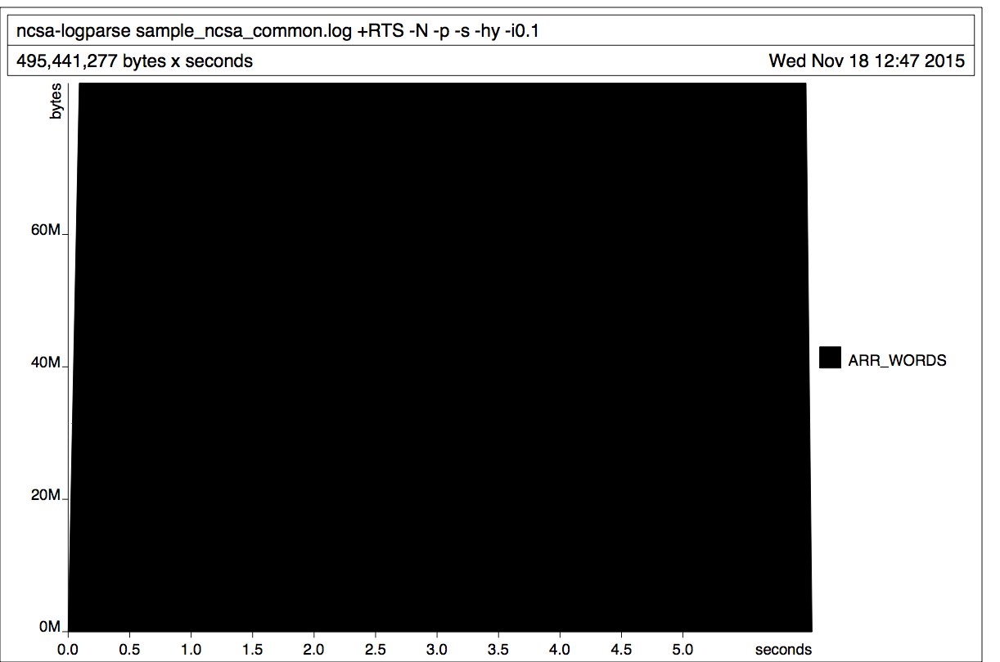

High-performance Log Parsing in Haskell: Part Two
=================================================

Welcome to the second and final blog post in this series on building a parser for log files in Haskell. In the [first part of the series](https://goo.gl/qfNMV2), we talked about why we chose Haskell for parsing logs, the theory behind and advantages of parsers and parser combinators, and concluded by building a parser for a very simplified kind of webserver log file.

In this post, we'll cover the mechanics of parsing more parts of a real log file and the mechanics of reading log files then applying our parser to the input. Finally we'll discuss some ways we can improve our parser's performance. The ultimate aim here is to show readers how to build a parsing utility that can work on [NCSA Common](https://en.wikipedia.org/wiki/Common_Log_Format) and [NCSA Combined](http://publib.boulder.ibm.com/tividd/td/ITWSA/ITWSA_info45/en_US/HTML/guide/c-logs.html#combined) log formats. Although this post will include code snippets, we are also providing readers with a [fully-functional reference implementation](https://github.com/mazelife/ncsa-logparse). 

Covering every single aspect of building a fully-functional parser could take far more than two blog posts, so this code is provided to help readers understand all the things that go into making a parser. This code is provided under the [BSD3 open source license](https://en.wikipedia.org/wiki/BSD_licenses#3-clause_license_.28.22Revised_BSD_License.22.2C_.22New_BSD_License.22.2C_or_.22Modified_BSD_License.22.29) with the hope that readers will feel comfortable forking and modifying this code to meet their needs. 

When we last left off, we were able to parse log files that looked like this:

```
GET 200
PUT 201
GET 404
POST 500
```
This simple format included just an HTTP method and an HTTP status code. Let's compare that to a full NCSA common log line:
```
216.74.39.38 - - [12/Jan/2015:20:37:55 +0000] "GET index.htm HTTP/1.0" 200 215
```
The space-delimited list of tokens corresponds to these values:

1. IP address the request originated from
2. The [rfc931](https://www.ietf.org/rfc/rfc931.txt) id and user name ("-" means these are unknown)
3. The timestamp of the request
4. The request method
5. The request URL
6. The protocol (HTTP) and version (1.0) of the request
7. The status code of the response
8. The number of bytes transmitted in the response (not including the header)

Here is a NCSA extended log line:

```
216.74.39.38 - - [12/Jan/2015:20:37:55 +0000] "GET index.htm HTTP/1.0" 200 215 "http://www.example.com/start.html" "Mozilla/4.08 [en] (Win98; I ;Nav)"
```

This is the same format, with two added values at the end:

9. The referring URL
10. The user agent string


We've already shown how to parse the request method and status code in part one; let's work on filling in some of the gaps, starting with IP address.

Parsing an IP address
---------------------

For the sake of brevity, we'll assume we are only dealing with IPv4 addresses. These addresses are represented in the log by four decimal numbers, each ranging from 0 to 255, separated by periods. Each part represents a group of 8 bits (an octet) of the address. In Haskell, a useful strategy is to think about the problem in terms of types and reason back from there. How might we represent an IP address using Haskell's type system?  We could just store it as a string, but if we wanted to answer a question like "how many users in this log came from a particular subnet?" we'd have to resort to string searching to answer the question.  Here's a more flexible way to represent IP addresses:

~~~Haskell
data IP = IP Word8 Word8 Word8 Word8 deriving (Eq)
~~~

Here an IP address is represented as a sequence of four ``Word8`` values. A [Word](https://hackage.haskell.org/package/word8-0.1.2/docs/Data-Word8.html) is an 8-bit unsigned integer type. How can we parse a string like "216.74.39.38" into this IP type? Here's one approach:

~~~Haskell
-- |Parse a period character.
period :: Parser Char
period = char '.'

parseIP :: Parser IP
parseIP = fmap IP
	    (decimal <* period)
	<*> (decimal <* period)
	<*> (decimal <* period)
	<*> decimal
~~~
These functions use two attoparsec parsers: [``decimal``](https://hackage.haskell.org/package/attoparsec-0.13.0.1/docs/Data-Attoparsec-Text.html#v:decimal) and [``char ``](https://hackage.haskell.org/package/attoparsec-0.13.0.1/docs/Data-Attoparsec-ByteString-Char8.html#v:char) to handle parsing an IP address. We begin by defining a utility function that we will end up using in a number of places. Sometimes we need to create a parser that will consume a single predefined character that we expect to encounter in a log line. Let's say we wanted one parser for a dash and one for a period. Attoparsec provides a useful function, `char` that will match a single specific character and fail on any other input:

~~~Haskell
period = char '.'

dash = char '-'
~~~

In an IP address we expect to encounter four numbers separated by three periods. If we were to represent this as a sequence of parsers, it would be:
```
decimal -> period -> decimal -> period -> decimal -> period -> decimal
```

However simply applying these parsers in sequence isn't enough. We want to *keep* the value parsed by `decimal` and *discard* the "." parsed by ``period``. The ``parseIP`` function shows how we can use attoparsec's parser combinators to achieve this in an elegant way. The ``<*`` [combinator](https://hackage.haskell.org/package/attoparsec-0.13.0.1/docs/Data-Attoparsec-Text.html#g:12) sequences two actions, discarding the value of the second argument. So the expression ``decimal <* period`` produces a single function that will expect to parse a digit and then a period from the input, but will throw out the result of the ``period`` action (which is just the value ``"."``) while returning the decimal value. Thinking in these terms, we need to have a sequence of three ``decimal <* period`` and a single ``decimal``. The sequential application function [``<*>``](http://hackage.haskell.org/package/base-4.8.1.0/docs/Control-Applicative.html#v:-60--42--62-) allows us to apply these 4 parsers one after another, giving us 4 values of the type `Parser Word8`. We want to construct an IP address from these 4 `Word8` values, but since they're inside a `Parser` monad, we use [``fmap``](https://hackage.haskell.org/package/base-4.7.0.1/docs/Control-Monad.html#v:fmap) to apply the IP constructor to the values inside.
This same function could also be written using do-notation, which might be easier to read for Haskell newcomers:

~~~Haskell
parseIP :: Parser IP
parseIP = do
	a <- decimal <* period
	b <- decimal <* period
	c <- decimal <* period
	d <- decimal
	return IP a b c d
~~~

We'll leave parsing of the user identifier and name as an exercise for the reader. If you're curious about one possible solution, you can look in the [reference implementation](https://github.com/mazelife/ncsa-logparse/blob/master/src/Parse/HTTP.hs).

Parsing a timestamp
-------------------
In this case we already have a Haskell type that we should use to represent this value: [``ZonedTime``](https://hackage.haskell.org/package/time-1.5.0.1/docs/Data-Time-LocalTime.html#t:ZonedTime), which stores a local time together with a ``TimeZone``. The question is, how do we go from a string like ``[12/Jan/2015:20:37:55 +0000]`` to a ``ZonedTime`` value?

It's relatively straightforward to tease out the individual pieces of the date we want:

~~~Haskell
parseTimeAndDate :: Parser ZonedTime
parseTimeAndDate = do
	_        <- char '['
	day      <- parseDigits 2
	_        <- slash
	month    <- take 3
	_        <- slash
	year     <- parseDigits 4
	_        <- char ':'
	hour    <- parseDigits 2
	_        <- char ':'
	minute   <- parseDigits 2
	_        <- char ':'
	second   <- parseDigits 2
	_        <- char ' '
	timezone <- count 3 letter_ascii
	_        <- char ']'
~~~

However, there are two complications. For the month, we have a value like "Apr" when what we really need is the month number, `4`. Similarly, we need to parse the ISO-8601 timezone string (e.g. -0700, +05, 09) into a [``TimeZone``](https://hackage.haskell.org/package/time-1.5.0.1/docs/Data-Time-LocalTime.html#t:TimeZone) object. Let's start by tackling the month problem. We have a head start in the `System.Locale` library: it includes a [``TimeLocale``](http://hackage.haskell.org/package/old-locale-1.0.0.7/docs/System-Locale.html#v:defaultTimeLocale) type that includes a listing of full and abbreviated months in calendar order:

~~~Haskell
import System.Locale

show (months defaultTimeLocale)
~~~

Which prints:

~~~
[("January","Jan"),("February","Feb"),("March","Mar"),("April","Apr"),("May","May"),
("June","Jun"),("July","Jul"),("August","Aug"),("September","Sep"),("October","Oct"),
("November","Nov"),("December","Dec")]
~~~

We don't care about the full month names, we only want the second item in the tuple, the abbreviation:

~~~Haskell
map snd (months defaultTimeLocale)
-- returns: ["Jan","Feb","Mar","Apr","May","Jun","Jul","Aug","Sep","Oct","Nov","Dec"]
~~~
Let's modify this a bit to lower-case the month names so our parser can be case-insensitive. The `Data.Char` library has a function `toLower` that converts a single character to lower-case. Since a string is just a list of characters, `map toLower` effectively converts an entire string to lowercase by mapping that function over every character in the `String`. We can compose this function with our `snd` function when we map it over the list of month tuples:

~~~Haskell
map (map toLower . snd) (months defaultTimeLocale)
-- returns: ["jan","feb","mar","apr","may","jun","jul","aug","sep","oct","nov","dec"]
~~~

How might we use this to convert from a month name to a number (e.g. from "feb" to 2)? This seems like a good place for a map, a data structure that goes from key (month abbreviation) to value (month number). The [``Data.Map``](http://hackage.haskell.org/package/containers-0.5.6.3/docs/Data-Map.html) library includes just such a type. It also includes a convenience function called [``fromList``](http://hackage.haskell.org/package/containers-0.5.6.3/docs/Data-Map-Strict.html#v:fromList) that takes a list of key/value tuple pairs. So if we can give it a list that looks like this:

~~~
[("jan", 1), "feb", 2),...]
~~~

...then we can build a mapping from month abbreviation to number. We already have the list of month abbreviations, we just need to [``zip``](http://hackage.haskell.org/package/base-4.8.1.0/docs/Prelude.html#v:zip) it up with a list of numbers:

~~~Haskell
let monthNames = map ((map toLower) . snd) (months defaultTimeLocale)
let monthMappingList = zip monthNames [1..]
~~~

The `[1..]` list is just an infinite sequence starting at one. One of the advantages of Haskell's lazy iteration is that this won't cause any problems. The zip function will only evaluate the infinite list as far as `12`, since that's how long the list of month abbreviations is. The `monthMappingList` looks like `[("jan",1),("feb",2),("mar",3)...]`. 


Out final ``monthMap`` function is this:

~~~Haskell
-- | A map from three-letter month names (case insensitive) to their numeric representation 
monthMap :: Map.Map String Int
monthMap = let monthNames = map ((map toLower) . snd) (months defaultTimeLocale)
	in Map.fromList $ zip monthNames (iterate succ 1)
~~~

 We can then wrap this with a ``monthNameToNumber`` function which takes a ``String`` representing the month abbreviation and returns a ``Maybe Int``:
 
~~~Haskell
-- | Attempt to convert a three-letter month name (case-insensitive) to its numeric representation.
monthNameToNumber :: String -> Maybe Int
monthNameToNumber monthName = Map.lookup normalizedMonthName monthMap
	where normalizedMonthName = map toLower monthName
~~~
 
This expression—``monthNameToNumber "Jun"``—evaluates to ``Just 6``, whereas ``monthNameToNumber "Baz"`` evaluates to ``Nothing``. Finally we can wrap  this function into a parser, ``parseMonthName``:

~~~Haskell
-- |Parse a three-letter month name into its numeric representation.
parseMonthName :: Parser Int
parseMonthName = monthNameToNumber <$> count 3 letter_ascii >>= checkMonth
	where checkMonth m = maybe (fail "Invalid month name.") return m
~~~
 
We count three ASCII characters from the input, apply ``monthNameToNumber`` to it and then pass that ``Maybe`` to a function that returns a ``fail`` if it got ``Nothing`` and ``Int`` if it got ``Just Int``. 

Notice how we keep the pure part of the operation—the transformation of ``"Oct"`` to ``10``—in it's own function and the monadic parts—parsing the string and [failing](http://hackage.haskell.org/package/base-4.8.1.0/docs/Prelude.html#v:fail) on an invalid month value—in their own function context. This makes testing much easier.

Fortunately time zone parsing is simpler. A timezone should be prepended by an optional "-" or "+" and either 2 or 4 characters. Here are some examples:

* ``"07"``: 7 hours ahead of GMT
* ``"-07"``: 7 hours behind GMT
* ``"+0700"``: 7 hours ahead of GMT
* ``"-0730"``: 7.5 hours behind GMT

Here is a function which can parse a timezone string following those rules:

~~~Haskell
parseTZ :: Parser TimeZone
parseTZ = minutesToTimeZone <$> signed parseTZDigits
	where parseTZDigits = liftA2 (+) ((* 60) <$> parseDigits 2) (parseDigits 2 <|> return 0)
~~~

We parse 2 digits, which represents our hours offset, then attempt to parse 2 more digits. If the parser encounters something other than a number for the second set, we assume that we're dealing with a two-digit and not a four-digit offset, and represent our minutes as ``0``. We multiply our hours value by ``60`` to convert to minutes, then add that to the minutes position. This gives us the total offset minutes, and we can apply [``minutesToTimeZone``](https://hackage.haskell.org/package/time-1.5.0.1/docs/Data-Time-LocalTime.html#v:minutesToTimeZone) to that to get a ``TimeZone`` object.

The `parseDigits` function referenced above is a useful utility that can be used in several places in our log parser. It looks like this:

~~~Haskell
-- | Parse a given number of numeric characters into a Numeric representation (i.e. Int or Integer).
-- `n` is the number of sequential numeric characters to parse.
parseDigits :: (Read a, Num a, Eq a) => Int -> Parser a
parseDigits n = (fst . head . readDec) <$> count n digit
~~~


Our final timestamp parser looks like this:

~~~Haskell
-- |Parse a date/time string into a LocalTime object from a
-- string like "[10/Oct/2000:13:55:36 -0700]"
parseTimeAndDate :: Parser ZonedTime
parseTimeAndDate = do
	_  <- char '['
	d  <- parseDigits 2
	_  <- slash
	mm <- parseMonthName
	_  <- slash
	y  <- parseDigits 4
	_  <- char ':'
	h  <- parseDigits 2
	_  <- char ':'
	m  <- parseDigits 2
	_  <- char ':'
	s  <- parseDigits 2
	_  <- char ' '
	tz <- parseTZ
	_  <- char ']'
	let localTime = LocalTime {
				localDay = fromGregorian y mm d,
				localTimeOfDay = TimeOfDay h m s

			}
	return ZonedTime {
				zonedTimeToLocalTime = localTime,
				zonedTimeZone = tz
	}
~~~

From a parsing standpoint, the timestamp is our most difficult challenge. Therefore we'll defer to the reference implementation for ways to implement the rest of the log parsing.

Putting It All Together
=======================

Now that we have walked through parsing four types of data from a log file (ranging from simple to complex) and provided an [implementation of the remainder](https://github.com/mazelife/ncsa-logparse) of the remainder, we can being assembling this into a program that parses a whole log file.

Let's begin by defining a data type to represent a parsed log line.

~~~Haskell
-- |A single log line from an NCSA Common or Extended-formatted log
data LogEntry = LogEntry {
	ip 		   :: IP,
	identity   :: Maybe ByteString,
	userid     :: Maybe ByteString,
	timestamp  :: ZonedTime,
	method     :: Maybe HTTPMethod,
	url        :: URL,
	proto      :: Maybe Protocol,
	protoVer   :: ProtocolVersion,
	status     :: Maybe Int,
	byteSize   :: Int,
	referrer   :: Maybe URL,
	userAgent  :: Maybe ByteString,
	browser    :: Maybe UAResult,
	platform   :: Maybe OSResult
} deriving (Show)

~~~

This type is a composite of types like `Int` and `ByteString` as well as some domain-specific types we've defined such as an IP address:

~~~Haskell
data IP = IP Word8 Word8 Word8 Word8 deriving (Eq)
~~~
...and HTTP method, protocol, and version:

~~~Haskell
data HTTPMethod = Get | Post | Put | Delete | Options | Head | Trace | Connect deriving (Show, Eq)

data Protocol = HTTP | HTTPS | FTP deriving (Show, Eq)

data ProtocolVersion = ProtocolVersion {
	majorVersion :: Int,
	minorVersion :: Int
} deriving (Eq)
~~~
 ...and a URL, which is just a [type-synonym](https://wiki.haskell.org/Type_synonym) for a bytestring:
 
 ~~~Haskell
 type URL = BC.ByteString
 ~~~
 
 For parsing the user agent string, we've turned to an existing Haskell library called [ua-parser](https://hackage.haskell.org/package/ua-parser) which includes a pair domain-specific types of it's own that model the family and major, minor, and patch versions of both the browser and operating system.
 
 Based on the specifications for an NCSA log file, some information is not guaranteed to be present, including the user identity, referrer, and user agent. In cases like these, we use the [`Maybe`](https://hackage.haskell.org/package/base-4.8.1.0/docs/Data-Maybe.html) type to encapsulate an optional value.
 
 Finally, we define a type to represent the result of a parsed logfile, which is nothing more than a list of `LogEntry` objects:
 
 ~~~Haskell
 type Log = [LogEntry]
 ~~~
 

 
## Reading a log file

At this point need to build a pipeline that goes from a file path for an existing log file all the way to a value of the type `Log`. The reference implementation builds a command-line tool that takes a file path as it's input, however command-line argument parsing is beyond the scope of this post. Let's assume a hard-coded file path for simplicity's sake: `~/logs/access.log`

So what we want is a function that satisfies this type signature:

~~~Haskell
import Data.ByteString

readLog :: FilePath -> [ByteString]
~~~
Note here that we're using `ByteString` here rather than Haskell's default `String` type. This is very important for speed and memory usage. In Haskell a `String` is represented as a linked list of `Char` values. For large volumes of string data, this is a very inefficient representation. By contrast a `ByteString` is a list of chunks and the data is stored in continuous blocks of memory. You can read more about this distinction in Chapter 8 of the book *Real World Haskell*: "[Efficient file processing, regular expressions, and file name matching](http://book.realworldhaskell.org/read/efficient-file-processing-regular-expressions-and-file-name-matching.html)"

Here's an implementation of the `readLog` function:

~~~Haskell
import qualified Data.ByteString as B
import qualified Data.ByteString.Char8 as BC

readLog :: FilePath -> IO [B.ByteString]
readLog path = B.readFile path  >>= return . BC.lines
~~~
We read the file into a `ByteString` then use the [`lines`](https://hackage.haskell.org/package/bytestring-0.10.6.0/docs/Data-ByteString-Char8.html#g:14) function to split it into individual lines. `readLog ~/logs/access.log` gives us a list of lines in that file. Now we need to parse them.

## Parsing log lines

The following parser sequences all the smaller parsers we wrote for individual, space-separated pieces of the log line and returns a LogEntry value.

~~~Haskell
parseAsCommonLogLine :: Parser LogEntry
parseAsCommonLogLine = fmap LogEntry
		parseIP
	<*> (space *> parseUserident)
	<*> (space *> parseUserident)
	<*> (space *> parseTimeAndDate)
	<*> (space *> quote *> parseHTTPMethod)
	<*> (space *> parseURL)
	<*> (space *> parseProtocol)
	<*> (slash *> parseProtocolVersion <* quote)
	<*> (space *> parseHTTPStatus)
	<*> (space *> parseByteSize)
	<*> return Nothing
	<*> return Nothing
	<*> return Nothing
	<*> return Nothing
~~~

This parser references some functions we've walked through building (like `parseTimeAndDate` , `parseHTTPMethod `, and `parseHTTPStatus`) and some that are defined in the reference implementation. As the name of the function suggests, this parses an NCSA common log-formatted line. Therefore the four referrer and user-agent components of our LogEntry `type` are represented as `Nothing` since these are not available in that log format. 

Now we need to define a function that takes a `ByteString` and returns either a `LogEntry` if the parse succeeded, or an error string if the parse failed. 

~~~Haskell
import Data.Attoparsec.ByteString (parseOnly)

parseFileLine :: B.ByteString -> Either String LogEntry
parseFileLine logLine = parseOnly parseAsCommonLogLine logLine
~~~

Attoparsec actually provides a function called [``parseOnly``](https://hackage.haskell.org/package/attoparsec-0.13.0.1/docs/Data-Attoparsec-ByteString.html#v:parseOnly) that does exactly that. As we've done in several cases with our parser examples, we can rewrite this in [point-free](https://wiki.haskell.org/Pointfree) style:

~~~Haskell
parseFileLine :: B.ByteString -> Either String LogEntry
parseFileLine = parseOnly parseAsCommonLogLine
~~~

``parseOnly`` takes two arguments: a parser and a ``ByteString``. Haskell is perfectly comfortable with [partial application](https://wiki.haskell.org/Partial_application). We can apply a function to one of it's arguments and that will give us a new function that just takes the remaining arguments.

Now let's write a function that takes a list of lines from the log file and returns a fully parsed `Log`.

~~~Haskell
import Data.Either (rights)

parseFileLines :: [B.ByteString] -> Log
parseFileLines logLines = rights (map parseFileLineStrict logLines)
~~~

We just `map` the `parseFileLine` function over a list of log lines, which gives a list of `[Either String LogEntry`] It's up to you what you do with the errors in your list (which will be on the left side of each `Either`). For simplicity's sake, we're just going to assume the log line was malformed and we'll toss those out. The [`rights`](http://hackage.haskell.org/package/base-4.8.1.0/docs/Data-Either.html#v:rights) function takes a list of `Either` and extracts all the Right elements in order. We can easily rewrite this in point-free style too:

~~~Haskell
parseFileLines :: [B.ByteString] -> Log
parseFileLines = rights . map parseFileLineStrict
~~~

Now that we have our list of log entries, let's do something with it. The reference implementation outputs log data as a CSV file. However, walking through the implementation of that is beyond the scope of this blog post. We will implement something less useful but easier: let's say we just want to know the total number of bytes transmitted by our server in the period the log file covers:

~~~Haskell
sumBytes :: Log -> Int
sumBytes log = sum (map byteSize log)
~~~

We just need to extract the bytes from each `LogEntry` (which the `byteSize` accessor does). Mapping this over all the `LogEntry` types gives us a list of `Int` values which we then sum. We can print it out at the end:

~~~
main :: IO ()
main = do
    logLines <- readLog "~/logs/access.log"
    let parsedLog = parseFileLines logLines
    let totalBytes = sumBytes parsedLog
    putStrLn ((show totalBytes) ++ " bytes returned.")
    return ()
~~~


Performance Considerations
--------------------------

If we compile this code and run it we notice two things. 

Firstly, it's pretty fast. For an NCSA common log file of 1,400,800 lines, it takes around 4 seconds to finish. Let's compare this to a simple bash one-liner using awk:

~~~shell
awk 'BEGIN { FS = " " } ; { sum += $1; } END { print sum; }' "$@" < ~/logs/access.log 
~~~

That also takes around 4 seconds, so we've managed to be as fast as awk, which is pretty good for a first try. (Of course if all you're doing is summing up the number of bytes in a log file, you're better off sticking with awk in the first place.)

Secondly, the parser uses a little over 81MB of memory to parse the log file. This seems high, and when we look at the size of the input log file (79MB), we might begin to suspect that our program is reading the whole file into memory before processing it. Fortunately, we don't have to go on a hunch; the GHC compiler has great tools for profiling. Some compilation flags will allow us to [generate a graph of memory allocation](http://book.realworldhaskell.org/read/profiling-and-optimization.html) on the heap over the life of the program. In this case the flags `-with-rtsopts=-N -p -s -hy -i0.1` will break down the graph by type. When we do this we see a graph like this:


The good news is that memory usage stays flat over time. The bad news is that pretty much all of our memory is allocated to the `ARR_WORDS` type. This is the compiler's term for a `ByteArray`, which is used to implement the `ByteString` type. The memory consumption of our parser has a linear relationship with the size of the input file currently and we need to fix that. The obvious answer is to read the input file in small chunks and keep track of the total number of bytes seen as we go. In this case memory usage would be constant, and roughly equal to the size of the chunks we read in (plus a small amount of overhead for the rest of the program). 

So far we've used the ByteString type to read in the file and feed it to the parser line-by-line. If we read the [documentation](https://hackage.haskell.org/package/bytestring-0.10.6.0/docs/Data-ByteString.html) for the ByteString library, we can see the problem right away:

>  Byte vectors are encoded as *strict* Word8 arrays of bytes, held in a ForeignPtr, and can be passed between C and Haskell with little effort.

The strictness of that type has caused our memory problems. We could try writing a function where we read in a little of the input at a time and feed it to the parser, but we actually don't have to because the ByteString library also has a [lazy bytestring variant](https://hackage.haskell.org/package/bytestring-0.10.6.0/docs/Data-ByteString-Lazy.html):

> A key feature of lazy ByteStrings is the means to manipulate large or unbounded streams of data without requiring the entire sequence to be resident in memory.

That sounds exactly like what we're dealing with. The attoparsec library is (mostly) strict, which means it requires the `ByteString` it parses to be fully read into memory.  But we are only feeding it one line at a time. We can store our whole file as a list of lazy chunks and only read enough of the string into memory at a time to obtain a line, which we then feed to the parser. This means we really just have to change two functions and let Haskell do the rest:

* `readLog`, which will now return a list of lazy bytestrings representing our file lines.
* `parseFileLine`, which needs to convert the lazy bytestring into a strict one before attempting to Parse it. 

The `readLog` function is very easy to fix. We just swap strict versions of our functions with lazy ones (the `Data.ByteString.Lazy` API basically parallels the  strict `Data.Attoparsec.ByteString` API)

~~~Haskell
import qualified Data.ByteString.Lazy as BL
import qualified Data.ByteString.Lazy.Char8 as BLC

readLog :: FilePath -> IO [BL.ByteString]
readLog path = BL.readFile path  >>= return . BLC.lines
~~~
 
The `parseFileLine` function requires just a little more work, since we have to convert from a lazy to a strict bytestring:

~~~Haskell
parseFileLine :: BL.ByteString -> Either String LogEntry
parseFileLine logFileLine = parseOnly parseAsCommonLogLine strictLogFileLine
    where strictLogFileLine = (B.concat . BL.toChunks) logFileLine
~~~

If we recompile this and run it again, we see the new version is just as fast, but never uses more then 4MB of memory, no matter how much data we give it. 

At this point, we have a parser with good performance and low memory usage. If we wanted to really to push harder on the "high performance" angle, there are still more things we could try:

* a multithreaded approach
* [stream fusion](https://hackage.haskell.org/package/stream-fusion) which allows the compiler to optimize-away the creation of intermediate representations in a list transformation pipelines
* [conduits](https://www.fpcomplete.com/user/snoyberg/library-documentation/conduit-overview) or [pipes](https://wiki.haskell.org/Pipes), two Haskell libraries designed specifically for doing high-performance, low-memory stream processing.

These are beyond the introductory scope of this article, but will be of interest to those wanting to dive more deeply into Haskell. 
